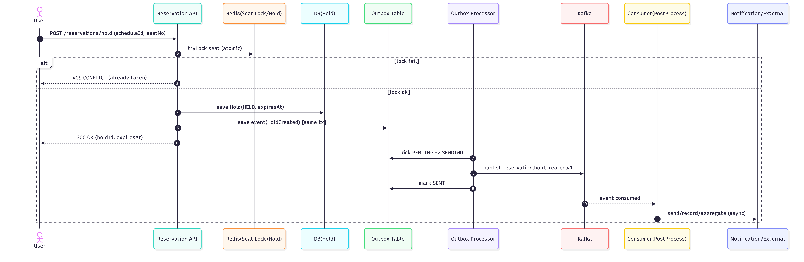
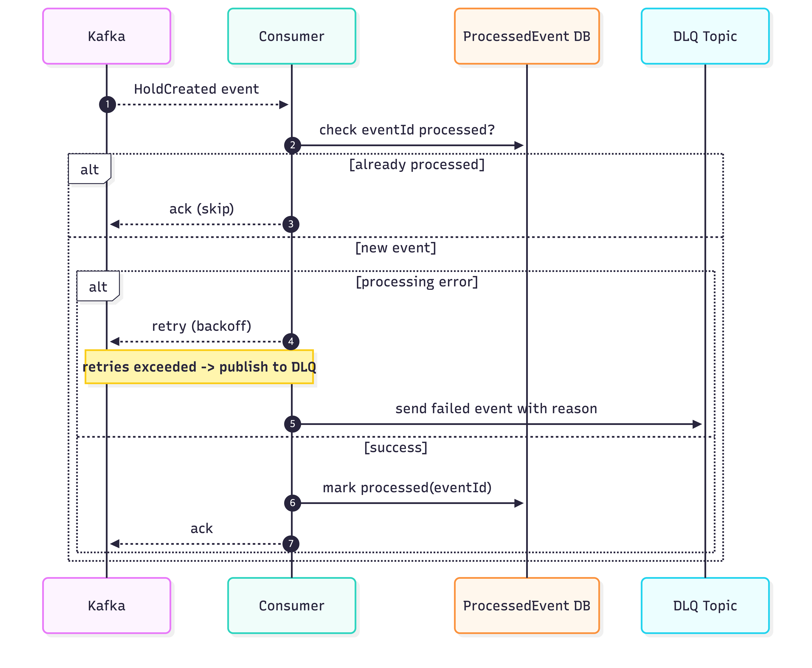

# 예약 시스템 트래픽 분석 및 Hold 폭주 대응 Kafka 설계 문서

------------------------------------------------------------------------

# (1) 트래픽 포인트 분석 결과

## 1. 목적

예약 오픈(티켓팅) 순간 발생하는 초고속/대용량 트래픽에서 시스템 병목 지점을 식별하고, Kafka 기반 비동기 이벤트 분리로 처리량/안정성/복구성을 개선한다.

------------------------------------------------------------------------

## 2. 트래픽 폭주 구간(Hot Spot) 식별

### A. 예약 오픈 순간 좌석 Hold 요청 폭주

### 현상

-   같은 scheduleId에 대해 수천\~수만 건의 Hold 요청이 짧은 시간에 집중
-   Redis/DB에서 경쟁 발생 → 락 경합, 타임아웃, 응답 지연 증가
-   Hold 성공/실패 후처리(알림, 로그, 집계, 데이터 전송)가 동기 흐름에
    붙어 있으면 연쇄 병목 발생

### 병목 포인트

1.  좌석 선점 원자성 보장(중복 선점 방지)
2.  동기 API 경로에 붙은 후처리로 인한 p99 지연 상승
3.  재시도 폭탄(클라이언트 retry)로 인한 추가 부하

### 개선 방향

-   Hold 자체는 짧고 단단하게(원자성 + 즉시 응답)
-   Hold 후처리는 Kafka 이벤트로 분리하여 consumer scale-out 구조로 전환

------------------------------------------------------------------------

### B. 결제 완료 후 후처리 폭탄

### 현상

-   Payment 완료 후 예약 확정/정산/알림/데이터 플랫폼 전송 등 연쇄 처리
-   외부 연동 장애가 결제 API를 끌고 죽이는 장애 전파 구조

### 개선 방향

-   Outbox + Kafka로 트랜잭션 정합성 확보
-   비동기 후처리 분리로 API SLA 보호

------------------------------------------------------------------------

### C. 알림/푸시/SMS 폭주

### 현상

-   오픈 직후 알림 이벤트 대량 발생
-   외부 발송 장애가 내부 API에 영향

### 개선 방향

-   notification.requested.v1 토픽으로 분리
-   Consumer scale-out 구조로 전환

------------------------------------------------------------------------

### D. 통계/랭킹/집계 업데이트

### 현상

-   실시간 집계를 동기 DB 연산으로 처리 시 쓰기/조회 경쟁 심화
-   인기 스케줄에 쓰기 집중

### 개선 방향

-   이벤트 스트림 기반 Consumer 집계
-   조회는 Redis 기반 read model 사용

------------------------------------------------------------------------

## 3. 결론: 우선순위

1)  Hold 폭주 대응 (예약 오픈 순간)
2)  결제 후 후처리 확장
3)  알림/집계 분리 구조 강화

------------------------------------------------------------------------

# (2) Hold 폭주 대응 Kafka 설계 문서

## 1. 개선 목표

-   예약 오픈 순간 Hold 요청 폭주에서도 p99 지연 안정화
-   Hold API는 빠르게 응답하고 후처리는 Kafka로 분리
-   장애 시 재처리/복구 가능 구조 확보

------------------------------------------------------------------------

## 2. Kafka를 사용하는 이유

-   동기 경로 최소화
-   Consumer scale-out 가능
-   장애 전파 차단
-   재처리 및 DLQ 운영 가능
-   Outbox 기반 정합성 보장

------------------------------------------------------------------------

## 3. 토픽 설계

### 토픽 목록

-   reservation.hold.created.v1
-   reservation.hold.created.v1.dlq

### Key 전략

-   message key = scheduleId
-   같은 공연 단위 순서 유지 목적

### 파티션 전략

-   초기 6\~12 partitions 권장
-   Consumer group scale-out 가능 구조

------------------------------------------------------------------------

## 4. 메시지 스키마 (Envelope 구조)

``` json
{
  "eventId": "uuid",
  "eventType": "ReservationHoldCreatedV1",
  "occurredAt": "2026-02-22T12:34:56Z",
  "version": 1,
  "aggregateId": "holdId",
  "key": "scheduleId",
  "payload": {
    "holdId": 123,
    "scheduleId": 1,
    "seatNo": 15,
    "userId": 99,
    "expiresAt": "2026-02-22T12:36:56Z"
  }
}
```

------------------------------------------------------------------------

## 5. 비즈니스 흐름 요약

1.  User -> Hold API 요청
2.  좌석 선점 원자성 처리
3.  Hold 저장 + Outbox 저장 (동일 트랜잭션)
4.  API 즉시 응답
5.  Outbox Processor -> Kafka 발행
6.  Consumer → 알림/집계/외부 연동 처리

5-7. 성공 흐름 (Hold는 동기, 후처리는 비동기)


5-8. 실패/재시도/DLQ


------------------------------------------------------------------------

## 6. 정합성 전략

### Producer

-   Outbox 패턴 적용
-   PENDING -> SENDING -> SENT/FAILED 상태 전이

### Consumer

-   processed_event 테이블 기반 멱등 처리
-   at-least-once 대비 중복 처리 방지

### Retry / DLQ

-   DefaultErrorHandler 기반 재시도
-   실패 시 .dlq 토픽 전송
